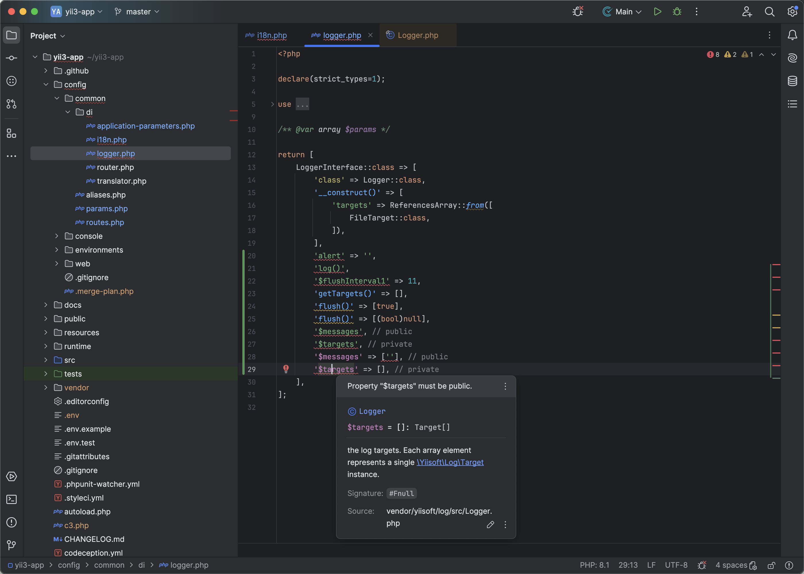
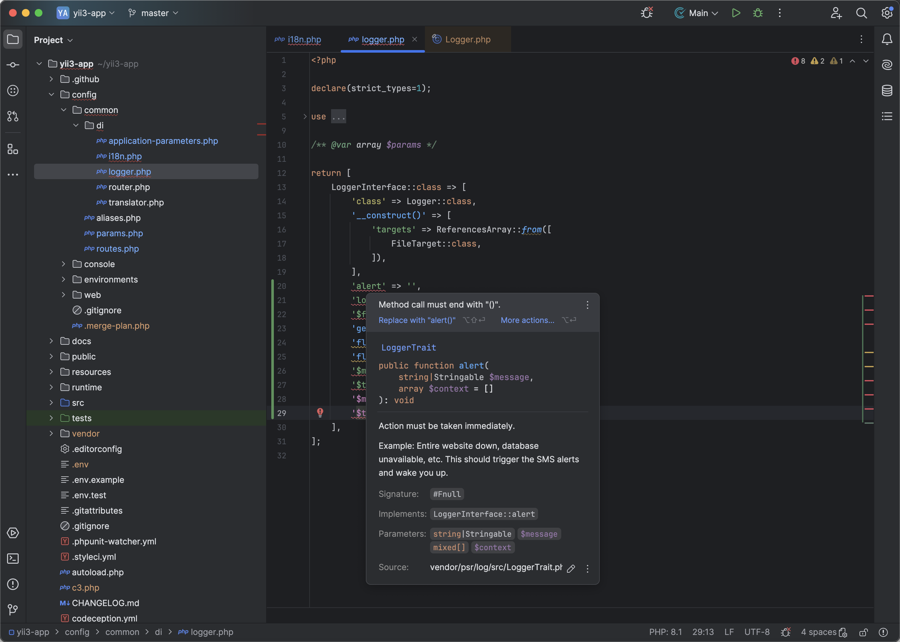
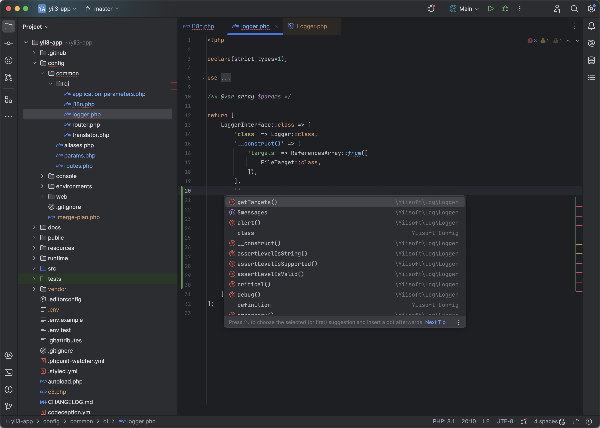
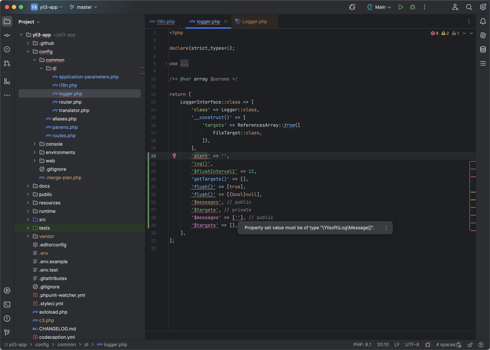
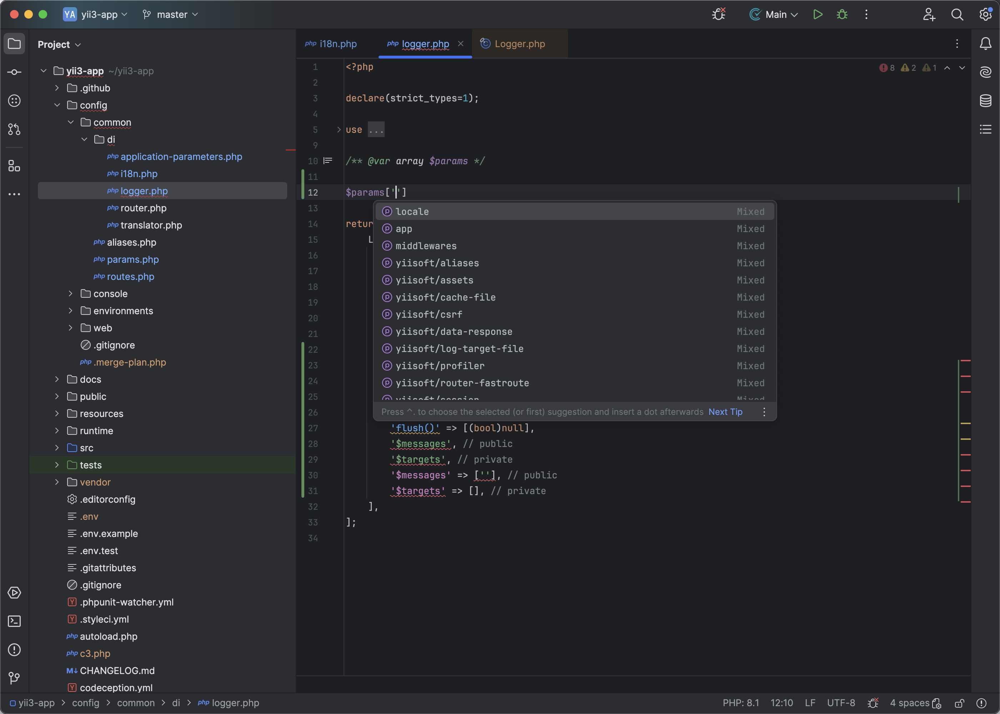

# Yiisoft Framework plugin for PHPStorm

<iframe width="245px" height="48px" src="https://plugins.jetbrains.com/embeddable/install/25388"></iframe>

Plugin for PHPStorm IDE for Yiisoft frameworks.

The primary objective is to support Yii3 while also preparing for future support for Yii2 / Yii1.

Currently, status of the plugin is under development. Some features may be unavailable during A/B testing and collecting UX reports.


## Plugin Marketplace

https://plugins.jetbrains.com/plugin/25388-yiisoft-framework

## Product Description

```
<h1>🚀 Elevate Your Yii Development!</h1>

<p>🔥 <strong>Boost your PHP development</strong> with the ultimate <strong>Yiisoft Framework</strong>! 🚀 Whether you're a beginner or an experienced developer, this plugin will transform the way you build apps with Yii. Speed up your workflow, reduce errors, and code smarter, not harder!</p>

<p>💥 <strong>Competing with Laravel and Symfony?</strong> Make your Yii development faster and easier with this dedicated plugin. Designed to work seamlessly within PHPStorm, it offers everything you need to supercharge your coding process. It's time to take your projects to the next level! 🚀</p>

<h2>⚡️ Key Features:</h2>
<ul>
    <li>✨ <strong>Lightning-fast autocompletion</strong> for Yiisoft components, classes, and methods.</li>
    <li>🔗 <strong>Seamless ORM integration</strong> with Yii's Active Record – connect with models, relationships, and database queries directly from your IDE.</li>
    <li>🚀 <strong>Time-saving code snippets</strong> – write less, achieve more with Yii-focused code templates.</li>
    <li>🐞 <strong>Real-time debugging</strong> – identify and fix issues as they happen, right inside PHPStorm.</li>
    <li>🛠 <strong>Smart refactoring</strong> – automatically optimize your code without breaking a single line.</li>
    <li>📦 <strong>Easy migration management</strong> – create, run, and manage your Yii migrations without leaving your IDE.</li>
</ul>

<h2>Why Choose Yiisoft Framework Plugin? 🤔</h2>
<ul>
    <li>⚡️ <strong>Fast and intuitive</strong> – designed for rapid development, so you can code efficiently without distractions.</li>
    <li>🚀 <strong>Boost productivity</strong> – fewer repetitive tasks, more time for creativity.</li>
    <li>🎉 <strong>Free trial available!</strong> Try before you buy – experience the power of this plugin risk-free.</li>
    <li>💡 <strong>Perfect for Yii developers</strong> – fully optimized for the <strong>Yiisoft Framework</strong>, giving you a custom fit for your coding style.</li>
</ul>

<h2>Laravel & Symfony Developer? Try Yii! 💥</h2>
<p>🌟 If you’re familiar with <strong>Laravel</strong> or <strong>Symfony</strong> but looking for a faster, more agile alternative, give <strong>Yii Framework</strong> a try! With this plugin, you’ll get the same benefits but with the unique power of <strong>Yiisoft</strong>. Compare it today!</p>

<h2>Who Is This For? 👨‍💻👩‍💻</h2>
<ul>
    <li>👶 <strong>PHP Beginners</strong> – Easy to use with intuitive tools to help you get started fast.</li>
    <li>💼 <strong>Professional Developers</strong> – Get the power and flexibility you need for complex projects.</li>
    <li>💻 <strong>Framework Enthusiasts</strong> – Looking for alternatives to Laravel or Symfony? The Yiisoft Framework is the perfect solution for robust, high-performance applications.</li>
</ul>

<p>💡 <strong>Start your journey</strong> with the <strong>Yiisoft Framework Plugin for PHPStorm</strong> now! 🚀 Don’t miss out on the opportunity to enhance your development speed and code like a pro. <strong>Download today</strong> and enjoy your free trial!</p>
```

## Screenshots

<details>
<summary>Show Gallery</summary>






</details>
